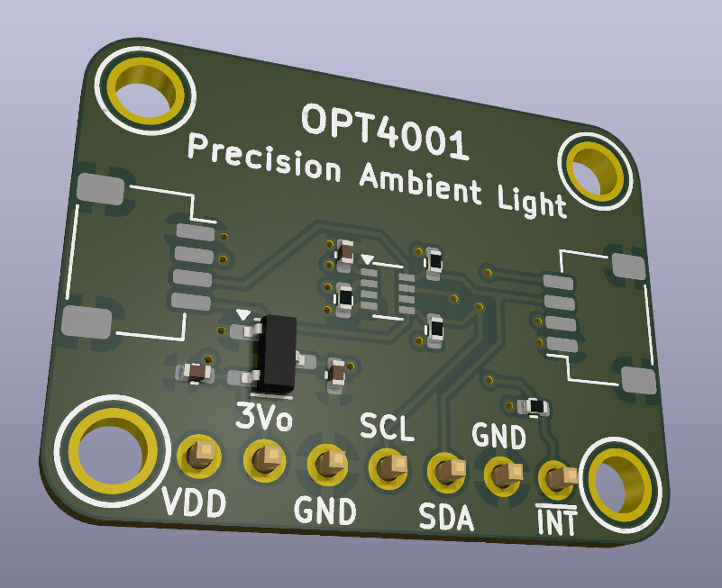

# OPT4001 STEMMA QT Ambient Light Sensor Board 🌞

A custom STEMMA QT compatible board featuring the OPT4001 high-precision ambient light sensor in SOT-5X3 package.

  

Features

- 📏 STEMMA QT / Qwiic compatible
- 🌈 OPT4001 sensor with human eye-like response
- 🔢 28-bit effective dynamic range
- 🔌 3.3V operation, 5V tolerant I/O
- 🧱 Designed in KiCAD 8

Specs

- Sensor: TI OPT4001 (SOT-5X3)
- Interface: I2C
- Voltage: 3.3V (5V tolerant SDA/SCL/INT)
- Connectors: 2x STEMMA QT / Qwiic
